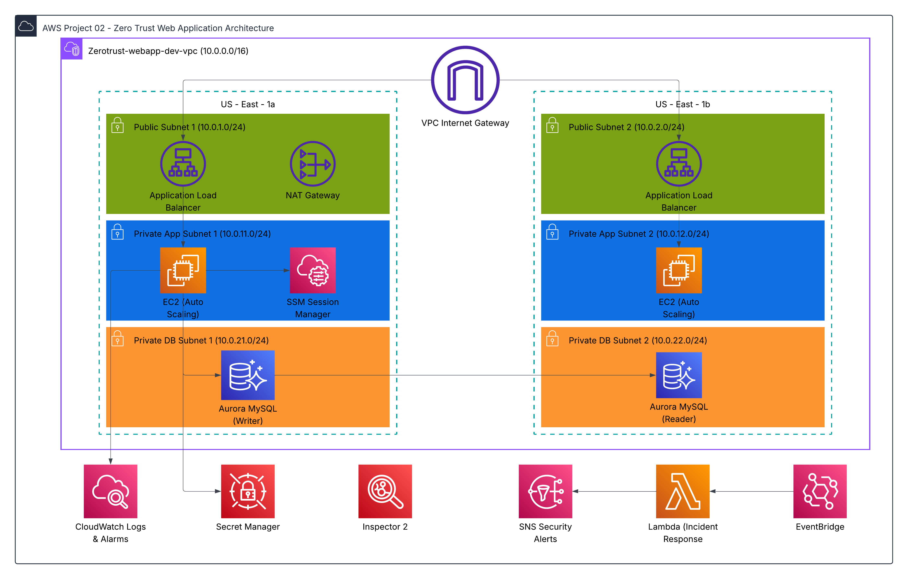

# Project 02 — Secure Multi-Tier Web Application with Zero Trust Architecture

## Business Context

A healthcare company handling sensitive patient data needed a secure, 
HIPAA-aligned web application. The goal was to eliminate traditional 
security risks like SSH key exposure, hardcoded credentials, and 
unencrypted traffic — replacing them with Zero Trust principles where 
no implicit trust is granted to any user, device, or service.

---

## Architecture Overview



### Phase 1 — Network Foundation
- Multi-AZ VPC with public, private app, and private database subnets
- VPC Endpoints (S3 Gateway, SSM, SSMMessages, EC2Messages) for private AWS service access
- NAT Gateway for outbound internet access from private subnets
- VPC Flow Logs → CloudWatch for network traffic analysis

### Phase 2 — Application Layer
- Application Load Balancer with sticky sessions
- Auto Scaling Group (EC2 t3.micro, Amazon Linux 2023)
- SSM Session Manager for secure instance access — no SSH keys or bastion
- RDS Aurora MySQL with encryption at rest
- Secrets Manager for database credentials — no hardcoded secrets

### Phase 3 — Security Automation
- AWS Inspector2 for continuous EC2 vulnerability scanning
- EventBridge + Lambda for automated incident response
- CloudWatch Alarms for CPU and unhealthy host detection
- SNS email alerts for security events

---

## Zero Trust Principles Applied

- No SSH keys — SSM Session Manager only
- No direct internet access to app or database tiers
- All AWS service traffic stays private via VPC Endpoints
- Least privilege IAM roles for all resources
- No hardcoded credentials — Secrets Manager only
- Automated incident response — no manual intervention required

---

## Compliance Alignment

- **HIPAA:** Access controls, audit logging, encryption at rest, incident response
- See [docs/architecture-decisions.md](docs/architecture-decisions.md) for full rationale

---

## How to Deploy

### Prerequisites
- Terraform >= 1.0 installed
- AWS CLI configured with valid credentials
- Region: us-east-1

### Step 1 — Deploy Network Foundation
```bash
cd terraform/phase-01-network-foundation
terraform init
terraform plan
terraform apply
```

### Step 2 — Deploy Application Layer
```bash
cd ../phase-02-application-layer
terraform init
terraform plan
terraform apply
```

### Step 3 — Deploy Security Automation
```bash
cd ../phase-03-security-automation
terraform init
terraform plan
terraform apply
```

> **Cost Warning:** Aurora RDS and NAT Gateway begin billing immediately.
> Destroy resources same day if this is a portfolio/demo deployment.

---

## How to Validate

### Confirm No SSH Access
- Navigate to EC2 → Security Groups
- Confirm no inbound rule exists on port 22 for app instances
- Confirm instances are only accessible via SSM Session Manager

### Confirm VPC Endpoints in Use
- Navigate to VPC → Endpoints
- Confirm SSM, SSMMessages, EC2Messages, and S3 endpoints show **Available**
- Confirm private route table routes S3 traffic through the gateway endpoint

### Confirm Secrets Manager Integration
- Navigate to Secrets Manager → `zerotrust-webapp-dev-db-credentials`
- Confirm secret exists and is encrypted
- Confirm no database passwords appear in any `.tf` or `.tfvars` files

### Confirm Incident Response Pipeline
- Navigate to EventBridge → Rules
- Confirm `zerotrust-webapp-dev-ec2-state-change` rule is **Enabled**
- Navigate to Lambda → confirm `zerotrust-webapp-dev-incident-response` is deployed
- Navigate to SNS → confirm email subscription is **Confirmed**
- Stop an EC2 instance manually to trigger the pipeline and verify SNS email alert fires

### Confirm CloudWatch Alarms
- Navigate to CloudWatch → Alarms
- Confirm `zerotrust-webapp-dev-high-cpu` alarm exists
- Confirm `zerotrust-webapp-dev-unhealthy-hosts` alarm exists

---

## How to Destroy

Destroy in reverse order to avoid dependency errors:
```bash
cd terraform/phase-03-security-automation
terraform destroy

cd ../phase-02-application-layer
terraform destroy

cd ../phase-01-network-foundation
terraform destroy
```

### Post-Destroy Checklist
- [ ] No EC2 instances running
- [ ] No RDS clusters running
- [ ] No NAT Gateways running
- [ ] No VPC Interface Endpoints active
- [ ] No ALB running
- [ ] Secrets Manager secret deleted
- [ ] Inspector2 disabled

---

## Infrastructure as Code

All resources deployed via Terraform across 3 phases:

| Phase | Directory | Resources |
|---|---|---|
| 1 — Network Foundation | `terraform/phase-01-network-foundation` | 27 |
| 2 — Application Layer | `terraform/phase-02-application-layer` | 18 |
| 3 — Security Automation | `terraform/phase-03-security-automation` | 11 |

---

## Tools & Technologies

- Terraform >= 1.0
- AWS (VPC, EC2, ALB, RDS Aurora, Secrets Manager, SSM, Inspector2, EventBridge, Lambda, SNS, CloudWatch)
- Python 3.12 (Lambda)
- GitHub: [AuthaHub](https://github.com/AuthaHub)

---

## Documentation

| Document | Description |
|---|---|
| [Architecture Decisions](docs/architecture-decisions.md) | Every design decision with HIPAA rationale |
| [Build Log](docs/build-log.md) | Phase-by-phase build log with troubleshooting |
| [Cost & Cleanup](docs/cost-and-cleanup.md) | Cost estimates and teardown log |
| [Resume Bullets](docs/resume-bullets.md) | Resume and LinkedIn bullets for this project |